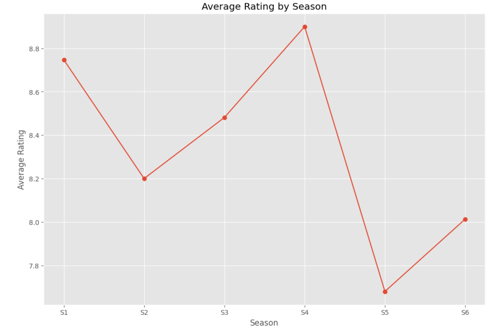

📊 Choufli Hal TV Show Data Analysis

This project is a data analysis of one of my favorite TV shows: Choufli Hal 🇹🇳.

📦 Dataset

The dataset used here was scraped by me from IMDb.
You can find the scraping project here 👉 chouflihal-imdb-scraper

The dataset includes the following columns:

    Episode – Episode number (e.g., E1, E2…)

    Season – Season number (e.g., S1, S2…)

    Episode Description – Short plot description

    Date of Release – Original air date

    Rating – IMDb rating (if available)

    Number of Raters – Number of IMDb users who rated the episode

🛠️ Technologies Used

    Python

    Pandas – data manipulation

    Matplotlib & Seaborn – data visualization

    Jupyter Notebook – exploration and plotting

🔍 Main Analysis Performed

    Handling missing data and type conversion

    Episode rating distribution analysis

    Actor frequency detection in episode descriptions (text analysis)

    Visualizations: histograms, bar plots  etc.

    Insights into character appearances across episodes

